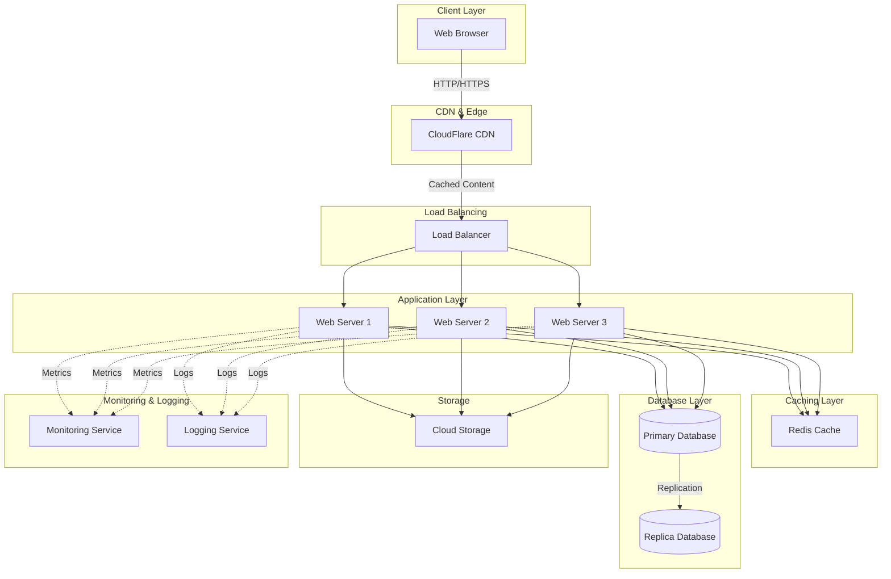

# Cloud Infrastructure Architecture

This document outlines the cloud infrastructure setup for the Apology project.

## Architecture Overview

## Components

### Client Layer
- **Web Browser**: End-user access point

### CDN & Edge
- **CloudFlare CDN**: Content delivery network for fast global distribution

### Load Balancing
- **Load Balancer**: Distributes incoming traffic across multiple web servers

### Application Layer
- **Web Servers (1-3)**: Multiple instances running the application for redundancy and scalability

### Caching Layer
- **Redis Cache**: In-memory data store for improved performance

### Database Layer
- **Primary Database**: Main database for read/write operations
- **Replica Database**: Secondary database for read operations and disaster recovery

### Storage
- **Cloud Storage**: File and object storage for static assets and backups

### Monitoring & Logging
- **Monitoring Service**: Real-time performance and health monitoring
- **Logging Service**: Centralized log aggregation and analysis

## Key Features

- **High Availability**: Multiple web servers behind a load balancer
- **Scalability**: Easy to add more web servers as needed
- **Performance**: CDN and caching layer for optimal response times
- **Redundancy**: Database replication for data protection
- **Observability**: Comprehensive monitoring and logging